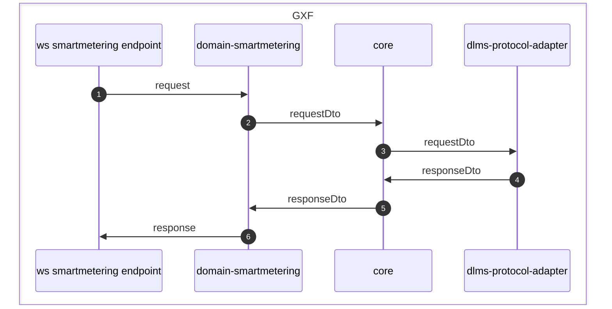

<!--
SPDX-FileCopyrightText: Contributors to the GXF project

SPDX-License-Identifier: Apache-2.0
-->

# Adapter domain smart metering

## General information

Domain smartmetering is responsible for forwarding requests received on the endpoints in ws-smartmetering to core. It also translates the requests to dto's that can be sent by core to the protocol adapter.

## Basic flow

1. A request received from ws smartmetering is processed by the [message processor](#message-processors) corresponding to the type of the request. The processor forwards the request to the correct service for handling the request.
2. The [service](#services) converts the request to a DTO and sends it to core.
3. Core sends the DTO to the correct protocol-adapter. For smartmetering, this is the dlms-protocol adapter.
4. The protocol-adapter sends the request to the device (in the appropriate protocol) and returns the response to core.
5. The OsgpCoreResponseMessageListener receives the response from core and calls the corresponding response message processor and service. 
6. Based on the resultdata received from core, the service creates the response message in internal format  and sends it to ws smartmetering.

## Links

### Message processors

For each type of request message, a message processor is available in the [messageprocessors](../osgp-adapter-domain-smartmetering/src/main/java/org/opensmartgridplatform/adapter/domain/smartmetering/infra/jms/ws/messageprocessors) package.

For bundle requests, the [BundleMessageProcessor](../osgp-adapter-domain-smartmetering/src/main/java/org/opensmartgridplatform/adapter/domain/smartmetering/infra/jms/ws/messageprocessors/BundleMessageProcessor.java) is used.

The task of the message processor is to call the right function in the right service to handle the request.

### Services

The [services](../osgp-adapter-domain-smartmetering/src/main/java/org/opensmartgridplatform/adapter/domain/smartmetering/application/services) convert a request to a DTOs. The DTOs is sent to core. The conversion is done by mappers. The services also handle the responses coming from core.

Requests are grouped based on their function:
- Adhoc service
- Configuration service
- Installation service
- Management service
- Monitoring service

Bundle requests are handled by the [BundleService](../osgp-adapter-domain-smartmetering/src/main/java/org/opensmartgridplatform/adapter/domain/smartmetering/application/services/BundleService.java).

### Mappers

To convert between the internal messages and the DTO objects, Orika mappers are used.

For single requests, the services call the mappers directly. For example: The `ConfigurationService` calls the `ConfigurationMapper`. These mappers can be found here: [Mappers](../osgp-adapter-domain-smartmetering/src/main/java/org/opensmartgridplatform/adapter/domain/smartmetering/application/mapping). Most request and response types are converted automatically, because the internal type and the DTO have the same fields. For some types, specific [converters](../osgp-adapter-domain-smartmetering/src/main/java/org/opensmartgridplatform/adapter/domain/smartmetering/application/mapping/customconverters) are needed.

For bundle requests, the bundle endpoint uses the [ActionMapperService](../osgp-adapter-domain-smartmetering/src/main/java/org/opensmartgridplatform/adapter/domain/smartmetering/application/services/ActionMapperService.java) and the [ActionMapperResponseService](../osgp-adapter-domain-smartmetering/src/main/java/org/opensmartgridplatform/adapter/domain/smartmetering/application/services/ActionMapperResponseService.java) to translate all requests and response in the bundle.

### Adapter ws smartmetering

[Main folder ws smartmetering](../osgp-adapter-ws-smartmetering)

[Readme of ws smartmetering](../osgp-adapter-ws-smartmetering/README.md)

Requests received from ws smartmetering, are sent by the
[endpoints](../osgp-adapter-ws-smartmetering/src/main/java/org/opensmartgridplatform/adapter/ws/smartmetering/endpoints).

### Core

[Main folder core](../osgp-core)

The main task of core is to send the request to the correct protocol adapter. For smart metering, core forwards the DTO request to the DLMS protocol adapter. Since no conversion of the DTO is done, core doesn't have smart metering specific mappers or services.

### DLMS Protocol adapter

[Main folder DLMS protocol adapter](../../protocol-adapter-dlms)

The DTO request is received in the protocol adapter by the message processor corresponding to the message type. For each message type, a processor is available in the [processors](../../protocol-adapter-dlms/osgp-protocol-adapter-dlms/src/main/java/org/opensmartgridplatform/adapter/protocol/dlms/infra/messaging/processors) package.
