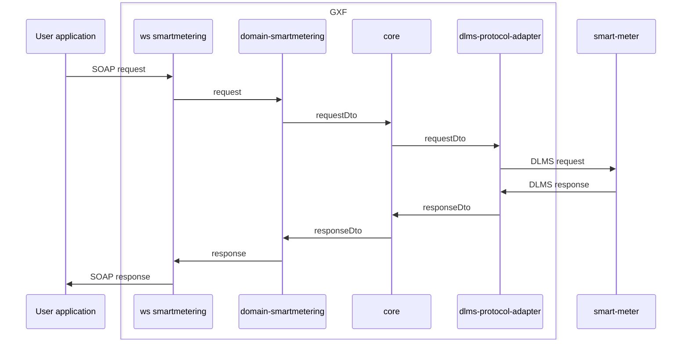
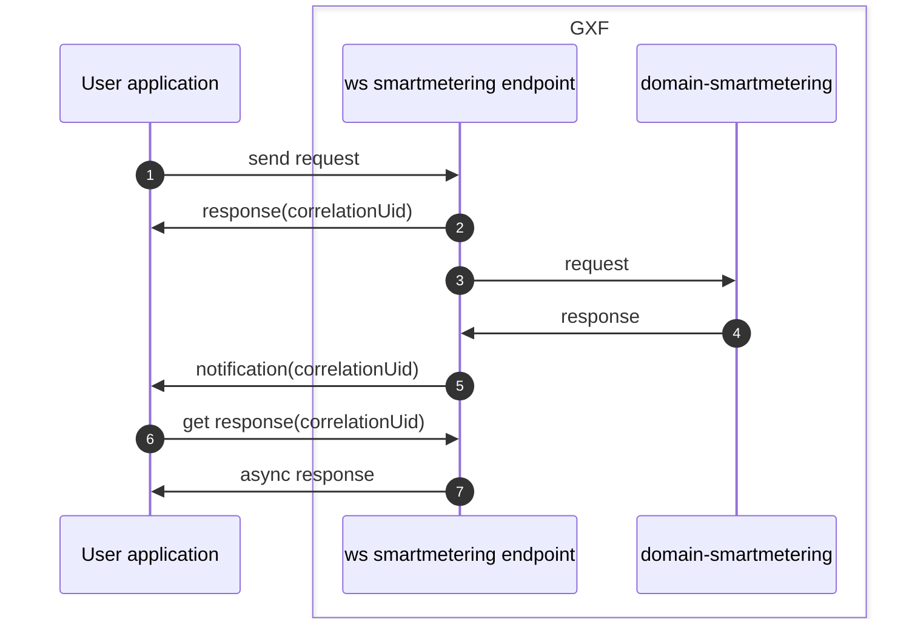

<!--
SPDX-FileCopyrightText: Contributors to the GXF project

SPDX-License-Identifier: Apache-2.0
-->

# Adapter WS smartmetering

This adapter is the entry point for user applications to use the smart metering functions of GXF. It receives the soap requests from the user application and forwards the request (converted to the internal format) to domain-smartmetering.

High-level general overview of the flow of a request through GXF:

The starting point for each request to a smart meter is an endpoint as specified by the [wsdl](#endpoint-and-message-specification).

# WS Smartmetering endpoints

## General information

The [endpoints](#endpoints) in this package allow a user application to send single and bundle requests and to get the async responses to those requests.

Endpoints for single requests are grouped based on their function:
- `Adhoc`
- `Configuration`
- `Installation`
- `Management`
- `Monitoring`

Endpoints for bundle requests can be found in `SmartMeteringBundleEndpoint`.

## Basic flow

1. The user application sends a SOAP request to an endpoint. The request should be in the format as defined in the [message specification](#endpoint-and-message-specification).
2. The user application immediately receives a response containing the `correlation-uid`.
3. The request is translated to the internal format (see the [mappers](#mappers)) and asynchronously forwarded to [domain smartmetering](#domain-smartmetering).
4. After some time (depending on the request and the connection to the device), a response is received.
5. The [NotificationService](#notificationservice) sends a notification with the correlationUid to the user application.
6. The user application can then request the result of the request, based on the correlationUid.
7. The async response is returned to the user application.

## Links

### Endpoint and message specification

The schema definitions (wsdl and xsd files) can be found in the `osgp-ws-smartmetering` package:
[wsdl and xsd files](../../shared/osgp-ws-smartmetering/src/main/resources)

### Endpoints

The code for the endpoints can be found in the [endpoints package](./src/main/java/org/opensmartgridplatform/adapter/ws/smartmetering/endpoints).

### Generated source code

Based on the schema definitions, source code is generated in the following location:
[generated source code](../../shared/osgp-ws-smartmetering/target/generated-sources/jaxb/org/opensmartgridplatform/adapter/ws/schema/smartmetering)

### Mappers

To convert between the external messages (as defined in the wsdl and xsd files) and the [internal objects](#internal-smart-metering-objects), Orika mappers are used.

For single requests, the endpoints call the mappers directly. For example: The `SmartMeteringAdhocEndpoint` calls the `AdhocMapper`. These mappers can be found here: [Mappers](src/main/java/org/opensmartgridplatform/adapter/ws/smartmetering/application/mapping)

For bundle requests, the bundle endpoint uses the [ActionMapperService](src/main/java/org/opensmartgridplatform/adapter/ws/smartmetering/application/services/ActionMapperService.java) and the [ActionMapperResponseService](src/main/java/org/opensmartgridplatform/adapter/ws/smartmetering/application/services/ActionMapperResponseService.java) to translate all requests and response in the bundle.

### Internal smart metering objects

For each request, response or other smartmetering related object, a class should be availabe in the [smartmetering](../osgp-domain-core/src/main/java/org/opensmartgridplatform/domain/core/valueobjects/smartmetering) package in osgp-domain-core.

Each function should be included in the [DeviceFunction](../osgp-domain-core/src/main/java/org/opensmartgridplatform/domain/core/valueobjects/DeviceFunction.java) enum in osgp-domain-core.

### NotificationService

The notification service is located in `osgp-adapter-ws-shared` package:
[NotificationService](../osgp-adapter-ws-shared/src/main/java/org/opensmartgridplatform/adapter/ws/shared/services)

### Domain smartmetering

[Main folder domain-smartmetering](../osgp-adapter-domain-smartmetering)

[Readme of domain-smartmetering](../osgp-adapter-domain-smartmetering/README.md)

Requests sent to domain-smartmetering, are received by the
[Message processors](../osgp-adapter-domain-smartmetering/src/main/java/org/opensmartgridplatform/adapter/domain/smartmetering/infra/jms/ws/messageprocessors) and then handled by the corresponding [Services](../osgp-adapter-domain-smartmetering/src/main/java/org/opensmartgridplatform/adapter/domain/smartmetering/application/services).
