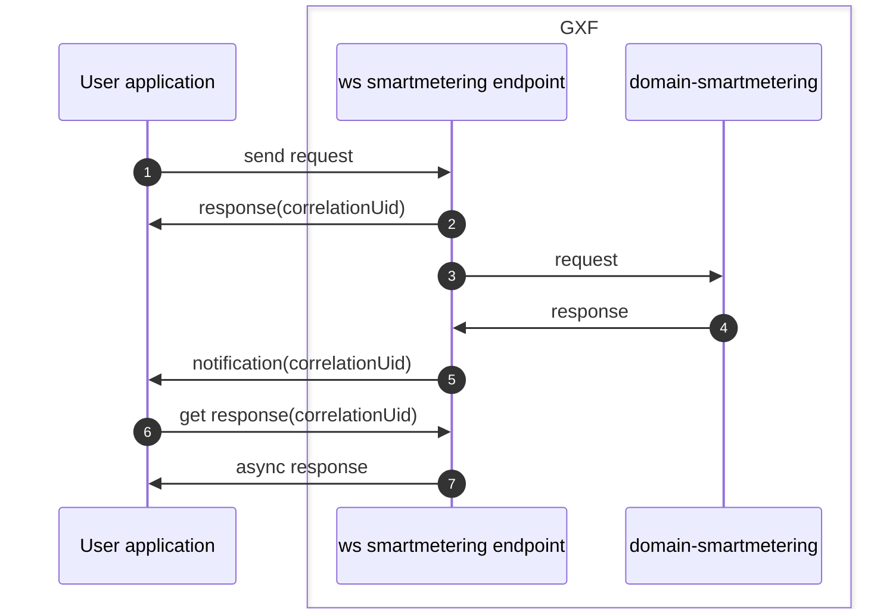

<!--
SPDX-FileCopyrightText: Contributors to the GXF project

SPDX-License-Identifier: Apache-2.0
-->

# WS Smartmetering endpoints

## General information

The endpoints in this package allows a user application to send single and bundle requests and to get the async responses to those requests.

Endpoints for single requests are grouped based on their function:
- `Adhoc`
- `Configuration`
- `Installation`
- `Management`
- `Monitoring`

Endpoints for bundle requests can be found in `SmartMeteringBundleEndpoint`.

## Flow

1. The user application sends a request to an endpoint. The request should be in the format as defined in the [message specification](#message-specification).
2. The user application immediately receives a response containing the `correlation-uid`.
3. The request is asynchronously forwarded to [domain smartmetering](#domain-smartmetering)
4. After some time (depending on the request and the connection to the device), a response is received.
5. The [NotificationService](#notificationservice) sends a notification with the correlationUid to the user application.
6. The user application can then request the result of the request, based on the correlationUid.
7. The async response is returned to the user application.

## Links

### Message specification

The schema definitions (wsdl and xsd files) can be found in the `osgp-ws-smartmetering` package:
[wsdl and xsd files](../../../../../../../../../../../shared/osgp-ws-smartmetering/src/main/resources)

### Generated source code

Based on the schema definitions, source code is generated in the following location:
[generated source code](../../../../../../../../../../../shared/osgp-ws-smartmetering/target/generated-sources/jaxb/org/opensmartgridplatform/adapter/ws/schema/smartmetering)

### Mappers

To convert between the external messages (as defined in the wsdl and xsd files) and the internal objects, Orika mappers are used: [Mappers](../../../../../../../../../../../platform/osgp-adapter-ws-smartmetering/src/main/java/org/opensmartgridplatform/adapter/ws/smartmetering/application/mapping)

### NotificationService

The notification service is located in `osgp-adapter-ws-shared` package:
[NotificationService](../../../../../../../../../../../platform/osgp-adapter-ws-shared/src/main/java/org/opensmartgridplatform/adapter/ws/shared/services)

### Domain smartmetering

[Main folder domain-smartmetering](../../../../../../../../../../../platform/osgp-adapter-domain-smartmetering)

Requests send to domain-smartmetering, are received by the
[Message processors](../../../../../../../../../../../platform/osgp-adapter-domain-smartmetering/src/main/java/org/opensmartgridplatform/adapter/domain/smartmetering/infra/jms/ws/messageprocessors) and then handled by the corresponding [Services](../../../../../../../../../../../platform/osgp-adapter-domain-smartmetering/src/main/java/org/opensmartgridplatform/adapter/domain/smartmetering/application/services).
